# Beatniks, Bumtrips, Bullshit

> A field-recorded journey through literature, consciousness, and counterculture.

[](https://github.com/bumtrips/beatniks-bumtrips-bullshit/actions/workflows/studio2201.yml)

The official website for the **Beatniks, Bumtrips, Bullshit** podcast — your secret audio dose of acid. Spontaneous conversations about mysticism, poetry, art, music, total bullshit, sci-fi, paranoia, dream, utopia, and friendship. Field-recorded in Berlin and Santa Cruz.

**Live site → [bumtrips.com](https://bumtrips.com)**

---

## What this repo is

A static, vanilla HTML + CSS + JS page served from GitHub Pages. No framework, no bundler, no backend. Episode data is fetched daily from the public podcast RSS feed by a GitHub Actions job and inlined into the page; the rest is hand-written.

> **Editing the page:** `index.src.html` is the source of truth — edit that file. `index.html` is generated from it by `scripts/minify.py` (comment-stripped, whitespace-collapsed, pointed at `styles.min.css`). Never edit `index.html` by hand; your changes will be overwritten.

The page rotates through six visual themes on auto-pilot:

| Theme | Vibe |
|---|---|
| **cyber** | acid green CRT, neon grid, signal-strength motifs |
| **zine** | cut-and-paste ransom-note, special-elite typewriter |
| **radio** | shortwave dial, phosphor amber, mono mono mono |
| **desert** | sun-bleached sand, ocre / turquoise, serif display |
| **temple** | incense, lapis, gold, Cinzel capitals |
| **brutalist** | bare concrete, system fonts, no nonsense |

Auto-rotation: 30–60 s on a randomized timer + scroll-triggered swaps. A `↻` button in the nav lets you cycle manually. `prefers-reduced-motion` is honored.

---

## Tech

- **HTML/CSS/JS only** — no npm, no framework, no bundler
- **GitHub Pages** + custom domain `bumtrips.com` (CNAME)
- **WCAG 2.1 AA**: skip links, focus rings, `prefers-contrast`, `forced-colors`, safe-area insets, 44 px tap targets
- **Six rotating themes** with on-demand Google Fonts loading (`ensureThemeFonts()`) so rotation feels instant
- **Minified**: `index.html` (~35 KB) is generated from `index.src.html` and `styles.min.css` (28 KB) from `styles.css` (40 KB). Drive script: `scripts/minify.py`.

---

## File layout

```
.
├── index.src.html            # the page (SOURCE — edit this)
├── index.html                # generated by scripts/minify.py — do not edit
├── styles.css                # source CSS (40 KB)
├── styles.min.css            # minified CSS (28 KB) — what the page loads
├── scripts/
│   ├── build_assets.py       # generates favicon + apple-touch-icon
│   ├── build_og_card.py      # generates the Open Graph card
│   ├── refresh_episodes.py   # rewrites AUTO-* regions in index.src.html from the RSS feed
│   └── minify.py             # produces index.html + styles.min.css from the sources
├── assets/
│   ├── org/                  # bumtrips org avatar + this repo's social preview
│   ├── favicon.svg
│   ├── favicon-32.png
│   ├── apple-touch-icon.png
│   └── og-card.png           # site Open Graph card
├── feed.xml                  # auto-discovered RSS link target (pointer to Anchor RSS)
├── sitemap.xml
├── CNAME                     # → bumtrips.com
└── data/
    └── apple_episode_ids.json  # episode guid → Apple Podcasts ID cache (per-episode links)
```

Episode data refreshes daily via the `refresh-episodes` GitHub Actions workflow, which fetches the public Anchor RSS feed, rewrites the `AUTO-*` marker regions in `index.src.html` (episode list, marquee titles), updates `data/apple_episode_ids.json`, then regenerates `index.html` via `scripts/minify.py` and commits the result.

---

## Releases

Tagged releases live on [github.com/bumtrips/beatniks-bumtrips-bullshit/releases](https://github.com/bumtrips/beatniks-bumtrips-bullshit/releases).

| Tag | What it shipped |
|---|---|
| `v2026.09.13` | Initial release, custom domain live |
| `v2026.09.13-hotfix1` | A11y + perf + mobile hardening |
| `v2026.09.13-hotfix2` | Phone nav overflow + faster rotation |
| `v2026.09.13-hotfix3` | Hero layout fix + inline SVG cover |
| `v2026.09.13-hotfix4` | 6 AI-generated theme covers |
| `v2026.09.13-hotfix5` | WebP covers, font slim-down, HTML/CSS minify |

---

## Listen

- [bumtrips.com](https://bumtrips.com)
- [Apple Podcasts](https://podcasts.apple.com/us/podcast/beatniks-bumtrips-b-t/id1663479533)
- [Spotify](https://open.spotify.com/show/43GiaQy9E5rkp6LfzXrvAM)
- [RSS](https://anchor.fm/s/4431c4ac/podcast/rss)

---

## How this site was built

The page layout, the a11y audit, the performance pass, the cover art, and this README were generated by AI agents working under human direction. The recording, the talking, and the editing are human.

---

## Contributing / reporting issues

- 🐛 **Site bug?** → [Open a `bug` issue](https://github.com/bumtrips/beatniks-bumtrips-bullshit/issues/new/choose)
- 📝 **Content correction** (typo, missing episode, wrong show notes)? → [Open a `content` issue](https://github.com/bumtrips/beatniks-bumtrips-bullshit/issues/new/choose)
- 🔒 **Security disclosure** → see [`SECURITY.md`](./SECURITY.md)
- ✉️ **General contact** → use the form on [bumtrips.com/contact](https://bumtrips.com/#contact)

---

## License & copyright

© 2026 bumtrips. See [`LICENSE`](./LICENSE). The site code is intentionally unlicensed for redistribution — the brand and audio are the show's.

---

<div align="center">

[](https://necrometer.dev/?u=bumtrips)

</div>
